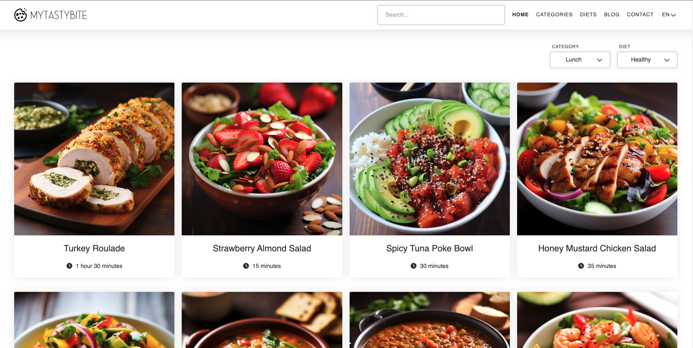
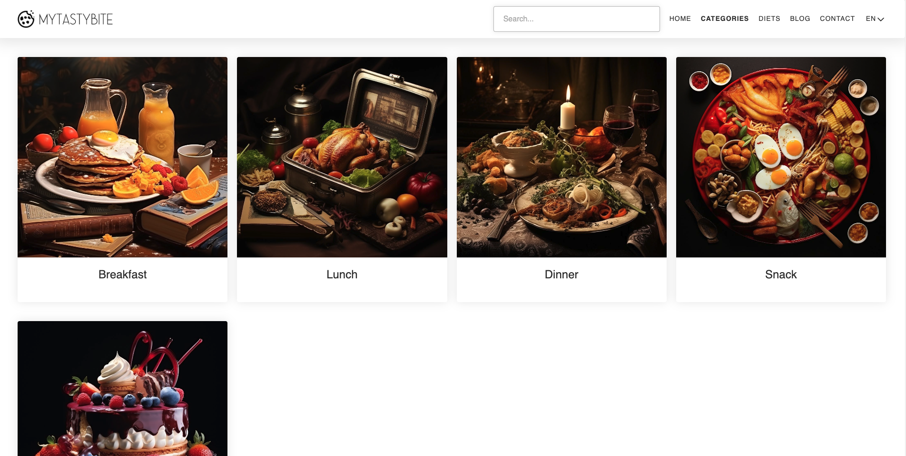
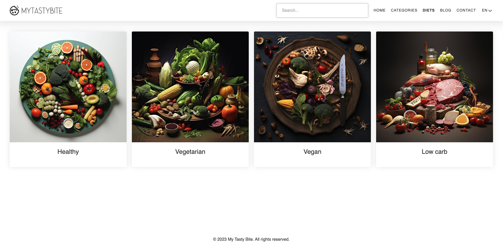
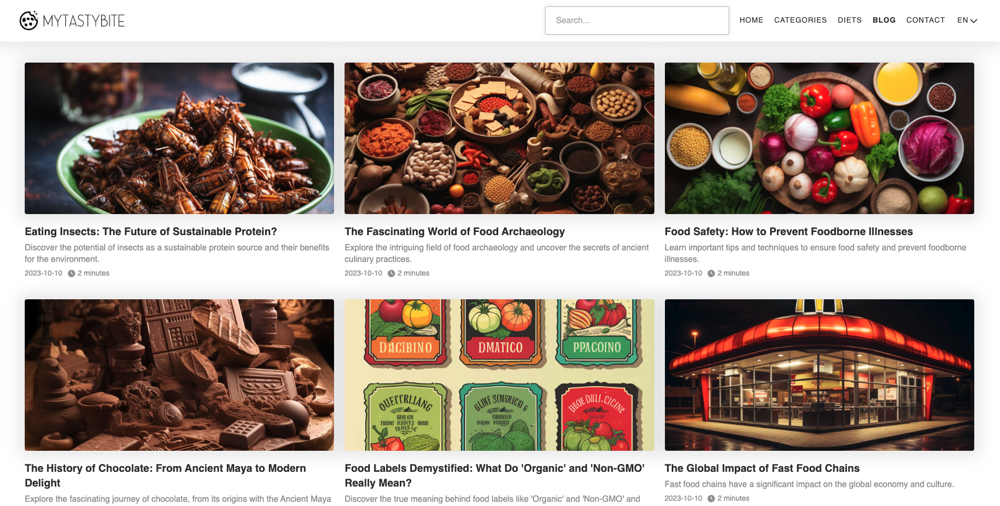

# mytastybite.com recipe website

Fullstack recipe website solution with blogging section and content management system developed using Next.js 13, averaging `33 ms` response time.

## Architecture

## Performance

## Features

- `Rate limiting` using token bucket algorithm
- `Internationalization` with scalability to add new languages, utilizing translations mechanism
- `Open Telemetry` integration
- `Content management system`
- `Authentication` using JWT and refresh tokens with token rotation strategy utilizing Redis
- `Session refresh` using seamless redirects upon client navigation and background refreshes on API requests
- `Mailer`
- `Crawler tracking`
- `Sitemap generation`
- `Image compression`
- `Automatic database seeding`
- `Search` using debounce
- `Pagination`
- `Custom form management solution`
- `Image upload` utilizing AWS S3 service
- `Rich text editor`
- `Image lazy loading` with an option to use low resolution preview images
- `Google Analytics`
- `Google Adsense`
- `Docker` build

## Infrastructure

In order to facilitate this project these infrastructure components are used:

- `AWS` as a cloud provider
- `EC2` as VM instance type
- `S3` as asset storage
- `Nginx` as a web server
- `Certbot` as certificate renewal solution
- `Let's Encrypt` as certificate authority
- `Cloudflare` as CDN solution with Full (strict) SSL/TLS encryption mode
- `New Relic` as application performance monitoring solution
- `Route 53` as DNS provider
- `Gmail` as email service

## Usage

The environment starts smoothly with a single command `npm run start:dev`, which starts both `cache` and `database` instances, seeds them, and starts a development application.

## Restructions

Next.js 13's middleware is tailored for usage on `Edge runtime`, which doesn't support core Node.js modules, which in turn prohibits usage of many tools, including the ones necessary for `rate limting` and `authentication`, so these have to be implemented per endpoint as of Next.js `13.5.1` implementation.

## Preview

### Homepage

### Recipe

### Categories

### Diets

### Blog

### Article

### Contact

### CMS Login

### CMS Dashboard

### CMS Article list

### CMS Article Edit Screen

### CMS Article Creation Screen

